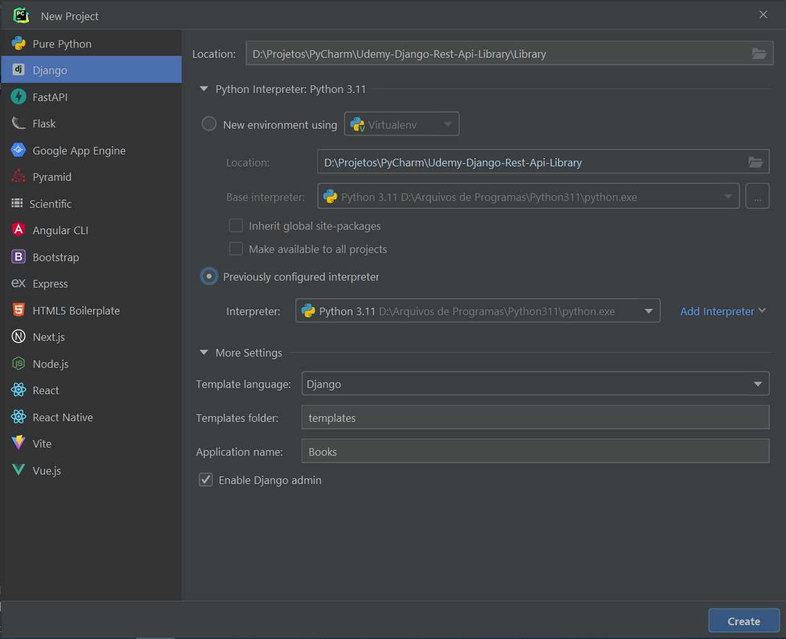
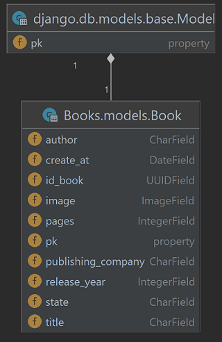

# Django RestFul Api - Library 
Projeto de uma RESTful API em Python com framework Django Rest Framework.

Obs.:
- Pode ser necessário renomear o diretório raiz para "Tasks" para executar o projeto.

## Instalação do Django e do Projeto

- `pip install django`
- `pip install djangorestframework`
- `pip install markdown`       # Suporte Markdown para a API navegável
- `pip install django-filter`  # Suporte de filtragem
- `pip install pillow`         # Suporte para imagens

## Comandos no terminal
- `django-admin startproject Library .` # cria projeto Django com nome "Library"
- `python manage.py makemigrations` # cria alterações no banco de dados de acordo com modificações das models
- `python manage.py migrate` # aplica as migrations
- `python manage.py runserver` # executa a aplicação

## Passos
Criar aplicação:
1. Criar projeto no PyCharm ou com ou `django-admin startproject Library .`

2. Adicionar app: Em Library > settings.py > INSTALLED_APPS, adicionar 'rest_framework'
3. Criar model: Em Books > models.py, criar classe Book com seus devidos campos 
4. Em Library > Books, criar pasta api
5. Na pasta api, criar o serializers.py
6. Na pasta api, criar o viewsets.py
7. Adicionar endpoint: alterar Library > urls.py
8. Criar migrations com `python manage.py makemigrations`
9. Aplicar migrations com `python manage.py migrate` 
10. Executar a aplicação pelo PyCharm ou com `python manage.py runserver`.

Adicionar campo image para Book:
1. Em Books > models.py: adicionar campo para armazenar a imagem
2. Em Library > settings.py: adicionar MEDIA_URL e MEDIA_ROOT
3. Em Library > urls.py: modificar urlpatterns
4. Criar migrations com `python manage.py makemigrations`
5. Aplicar migrations com `python manage.py migrate` 
6. Executar a aplicação pelo PyCharm ou com `python manage.py runserver`.

## Recurso

# Referências
Udemy - Crie RESTful API com Django Rest Framework - PARA QUALQUER UM: 
https://www.udemy.com/course/crie-restful-api-com-django-rest-framework-para-qualquer-um